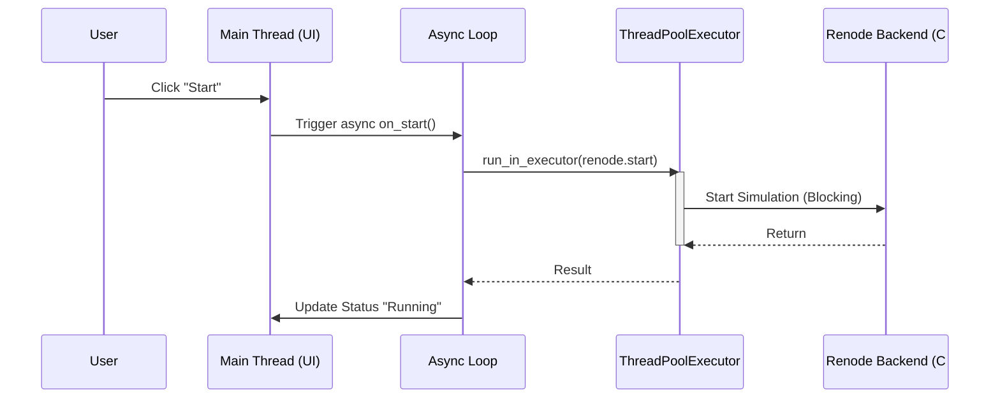

# Renode Async UI: Requirements & Design Plan

## 1. Overview
The goal is to create a responsive, asynchronous Graphical User Interface (GUI) for the [Renode](https://renode.io/) simulation framework using `pyrenode3`. The UI must remain responsive while heavy simulation tasks (loading scripts, polling memory) occur in the background.

## 2. Technology Stack
*   **Language**: Python 3.10+
*   **Backend**: `pyrenode3` (CLR/Mono bindings to Renode)
*   **Frontend**: `PySide6` (Qt for Python)
*   **Async Bridge**: `qasync` (Integrates `asyncio` with the Qt Event Loop)

## 3. Functional Requirements

### 3.1 Simulation Control
*   **Load Script (.resc)**:
    *   User must be able to select a file from the disk.
    *   Loading must happen asynchronously (no UI freeze).
    *   Error reporting if the script fails to parse.
*   **Execution Control**:
    *   **Start/Resume**: Start the simulation clock.
    *   **Pause**: Pause the simulation clock.
    *   **Reset**: Clear the emulation and reset state.

### 3.2 Memory Inspection (The "Watch" List)
The user must be able to define a list of memory addresses to monitor.

*   **Configuration**:
    *   **Address**: Hexadecimal string (e.g., `0x8000`).
    *   **Type**: Byte (8-bit), Word (16-bit), DWord (32-bit), or String.
    *   **Name**: User-friendly label (e.g., "Sensor Buffer").
*   **Live Updates**:
    *   The UI must poll these addresses periodically (e.g., every 500ms) **only** when the simulation is running.
    *   Changes in values should be highlighted visually.

### 3.3 System Logging
*   Capture standard Renode log messages.
*   Display connection status (Connected/Disconnected/Error).

## 4. Architecture & Data Flow

### 4.1 The Async Worker Pattern
Since `pyrenode3` calls are blocking (CLR boundaries), they cannot run on the main thread (GUI thread). We will use an executor pattern to offload these calls.

**Flow:**
1.  **UI Event**: User clicks "Start".
2.  **Async Slot**: The button triggers an `async def on_start()` method.
3.  **Executor Offload**: The method calls `await loop.run_in_executor(None, renode_wrapper.start)`.
4.  **Background Thread**: The thread performs the C# call.
5.  **Await Return**: Control returns to the main thread.
6.  **UI Update**: The UI updates the status label to "Running".



### 4.2 Configuration Persistence
*   **Format**: JSON
*   **Content**: Last loaded script path, list of watched addresses.
*   **Auto-load**: On startup, the tool attempts to restore the previous session.

## 5. Error Handling Strategy
*   **CLR Exceptions**: Catch `System.Exception` (from C#) and display as UI dialogs.
*   **Connection Failures**: If Renode backend crashes, the UI should go into a "Disconnected" state rather than crashing to desktop.

## 6. Proposed Project Structure
```text
renode_ui/
├── main.py              # Entry point
├── ui/
│   ├── main_window.py   # Main Window definition (PySide6)
│   └── widgets/         # Custom widgets (MemoryWatch, LogView)
├── backend/
│   ├── renode_wrapper.py # Blocking calls to pyrenode3
│   └── async_bridge.py   # Async wrappers around renode_wrapper
├── config/
│   └── settings.py      # Configuration management (JSON)
└── assets/              # Icons, styles
```